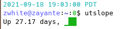

# Documentation

This is my personal documentation repository.

## Scripts

### borderlands2

Borderlands2 save file editor.

### docker_deploy

Script to deploy a container from the Dockerfile in the current directory.

### git-conflict

Script to resolve git-conflicts in an automated fashion.

### git-ssh

Change the current git remote from https to ssh.

### monitoring

Check the current system over and highlight any faults.

### todiscord

A simple script to send a message to discord over MQTT.

### utslope

A simple script that shows the number of days your system has been up along with a sparkline showing the load average.

